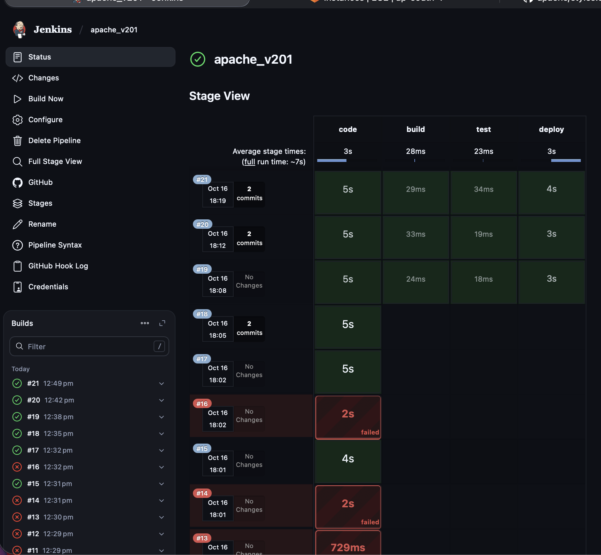
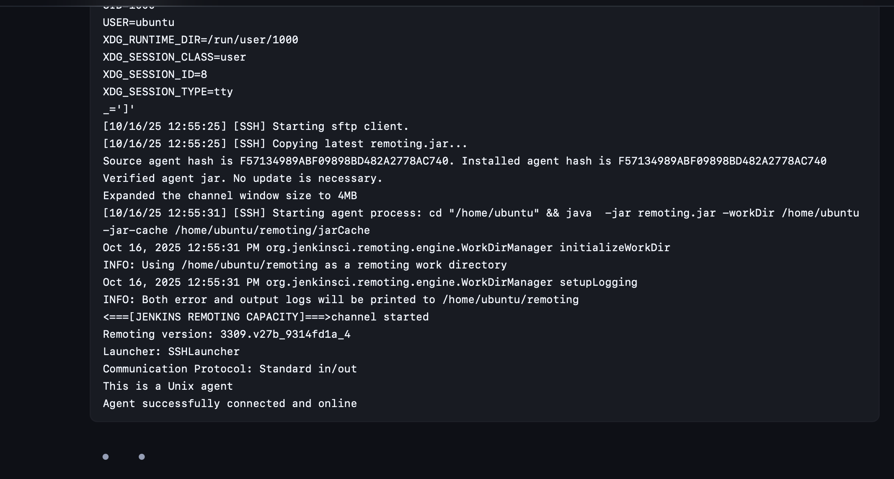
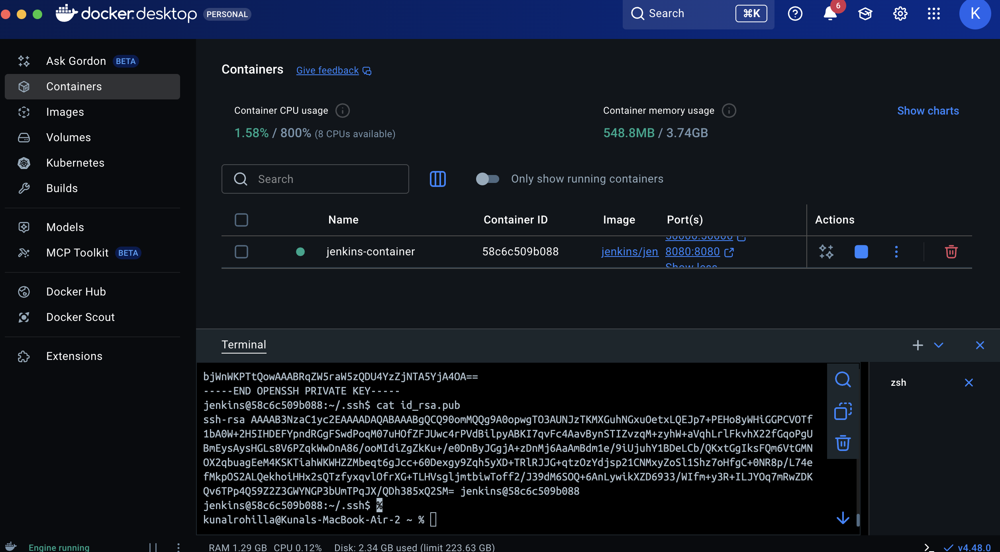
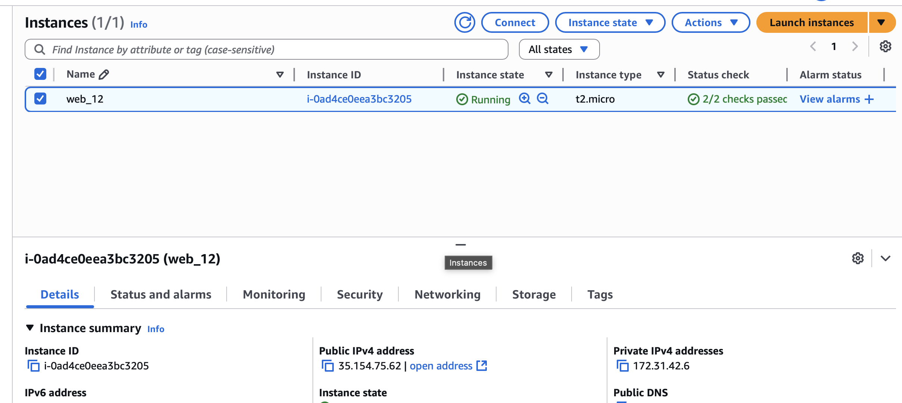
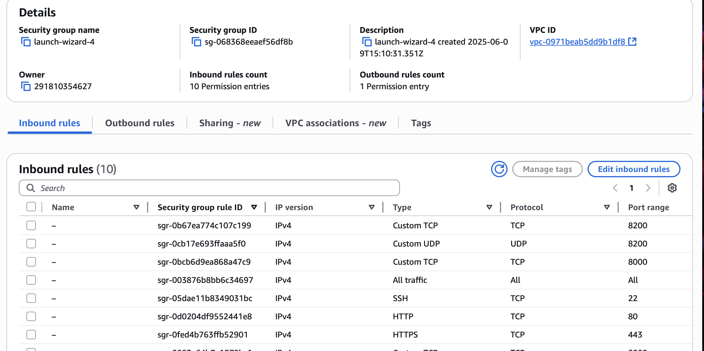
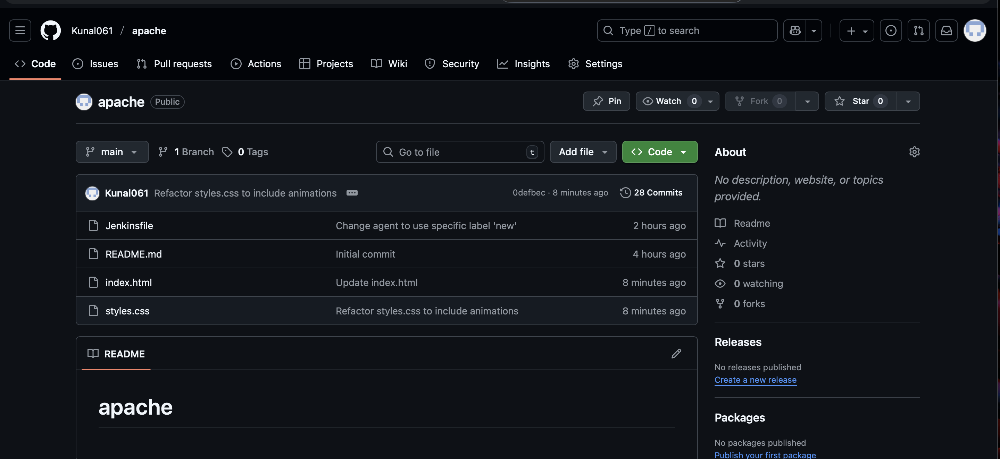
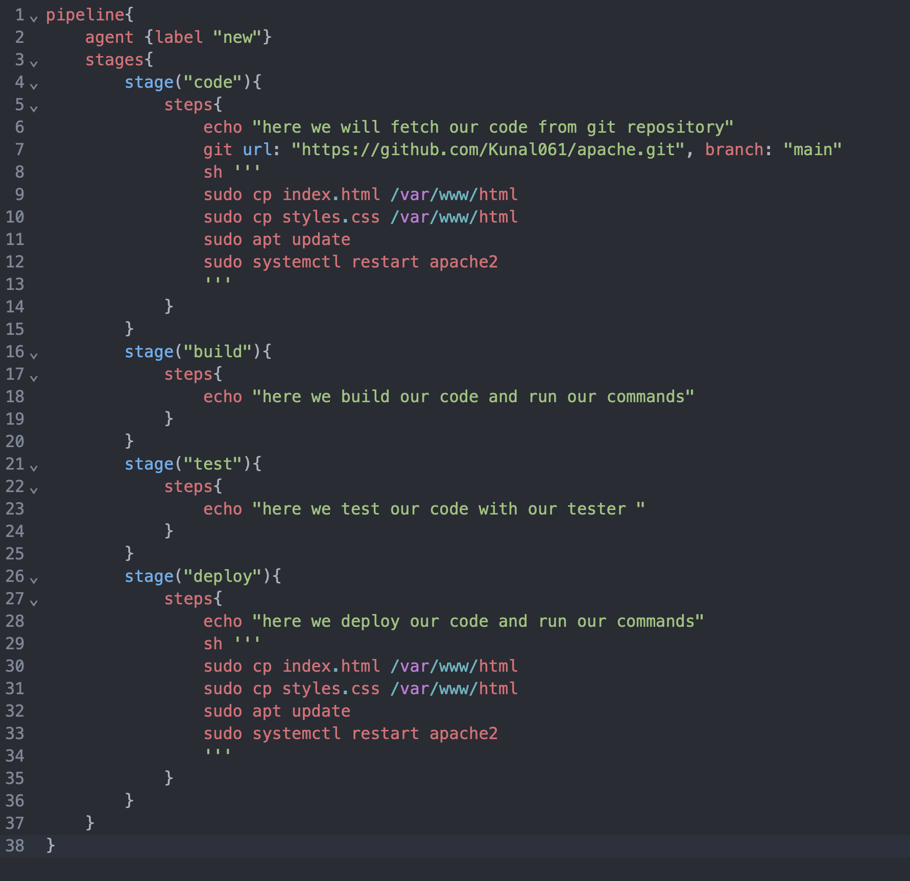

# End-to-End CI/CD Pipeline for Automated Web Hosting on AWS


This repository documents the setup of a complete CI/CD pipeline that automates the deployment of a static website. By integrating **GitHub, Jenkins, Docker, and AWS EC2**, this project achieves a zero-touch deployment workflow where every `git push` to the main branch automatically updates the live website.

---

## 📋 Table of Contents

1.  [Project Overview](#-project-overview)
2.  [Architecture Diagram](#-architecture-diagram)
3.  [Core Features](#-core-features)
4.  [Technology Stack](#-technology-stack)
5.  [Prerequisites](#-prerequisites)
6.  [Step-by-Step Configuration Guide](#-step-by-step-configuration-guide)
    * [Part 1: AWS Infrastructure Setup](#part-1-aws-infrastructure-setup)
    * [Part 2: Jenkins Master Setup with Docker](#part-2-jenkins-master-setup-with-docker)
    * [Part 3: Configure EC2 as a Jenkins Agent Node](#part-3-configure-ec2-as-a-jenkins-agent-node)
    * [Part 4: Create the Jenkins Pipeline](#part-4-create-the-jenkins-pipeline)
7.  [How to Use](#-how-to-use)
8.  [Troubleshooting Common Issues](#-troubleshooting-common-issues)
9.  [Future Enhancements](#-future-enhancements)
10. [License](#-license)

---

## 🚀 Project Overview

The primary goal is to build a robust, automated pipeline that eliminates manual deployment tasks. The system monitors a GitHub repository and, upon detecting a change, securely fetches the latest code, transfers it to a web server, and makes the updates live. This project serves as a practical demonstration of modern DevOps principles.

**Live Site URL:** `http://<your_ec2_elastic_ip>`

---

## 📊 Architecture Diagram

The flow of the pipeline is as follows:

1.  **Developer** pushes new code to the **GitHub Repository**.
2.  A **GitHub Webhook** instantly triggers the **Jenkins Pipeline**.
3.  The **Jenkins Master** (running in a Docker container) orchestrates the job.
4.  It delegates the execution to the **Jenkins Agent** running on the **AWS EC2 Instance** via a secure SSH connection.
5.  The **Jenkins Agent** clones the latest code from GitHub and deploys it to the **Apache Web Server** running on the EC2 instance.
6.  The **Live Website** is updated and available at the Elastic IP address.


*CI/CD Pipeline Architecture showing the complete workflow from GitHub to live deployment*

---

## ⚡ Core Features

*   **Automated Build & Deploy**: Code changes are automatically detected and deployed without manual intervention.
*   **Containerized Jenkins**: The Jenkins Master runs in Docker, ensuring portability and easy replication.
*   **SSH-Based Agent**: The EC2 instance acts as a Jenkins agent, securely connected via SSH.
*   **Webhook Integration**: GitHub webhooks trigger the pipeline instantly upon code commits.
*   **Elastic IP**: The website uses a static Elastic IP address for consistent access.

---

## 🛠 Technology Stack

*   **Cloud Provider**: AWS (EC2, Elastic IP)
*   **CI/CD Tool**: Jenkins
*   **Containerization**: Docker
*   **Version Control**: GitHub
*   **Web Server**: Apache (on EC2)
*   **Operating System**: Ubuntu (on EC2)
*   **Scripting**: Groovy (Jenkinsfile), Bash

---

## 📝 Prerequisites

Before starting, ensure you have the following:

*   An **AWS account** with permissions to launch EC2 instances and allocate Elastic IPs.
*   A **GitHub account** to host your repository.
*   **Docker** installed on your local machine (for Jenkins Master).
*   Basic knowledge of **Git**, **SSH**, and **Linux commands**.

---

## 🚀 Step-by-Step Configuration Guide

### Part 1: AWS Infrastructure Setup

#### Step 1.1: Launch an EC2 Instance

1.  Log into your **AWS Management Console**.
2.  Navigate to **EC2** and click **Launch Instance**.
3.  Choose **Ubuntu Server 22.04 LTS (Free Tier eligible)** as the AMI.
4.  Select **t2.micro** instance type (Free Tier eligible).
5.  Create a new key pair or use an existing one (this key will be used for SSH access).
6.  In **Network Settings**, create a new security group or use an existing one.


*Launching a new EC2 instance with Ubuntu Server*

#### Step 1.2: Configure Security Group

1.  In your security group, add the following **Inbound Rules**:

    | Type         | Protocol | Port Range | Source      | Description                  |
    | ------------ | -------- | ---------- | ----------- | ---------------------------- |
    | SSH          | TCP      | 22         | My IP       | SSH access from your machine |
    | HTTP         | TCP      | 80         | 0.0.0.0/0   | Public web access            |
    | Custom TCP   | TCP      | 8080       | My IP       | Jenkins Master access        |
    | Custom TCP   | TCP      | 50000      | My IP       | Jenkins Agent communication  |

2.  Click **Launch Instance**.


*Security group inbound rules for EC2 instance*

#### Step 1.3: Allocate and Associate an Elastic IP

1.  In the EC2 console, go to **Network & Security > Elastic IPs**.
2.  Click **Allocate Elastic IP address**.
3.  Select the newly created Elastic IP and click **Actions > Associate Elastic IP address**.
4.  Choose your running EC2 instance and associate it.

**Note:** Save this Elastic IP address—it will be the public URL for your website.


*Allocating and associating an Elastic IP to the EC2 instance*

#### Step 1.4: SSH into the EC2 Instance

```bash
ssh -i /path/to/your-key.pem ubuntu@<your_ec2_elastic_ip>
```

#### Step 1.5: Install Apache Web Server

```bash
sudo apt update
sudo apt install apache2 -y
sudo systemctl start apache2
sudo systemctl enable apache2
```

Verify installation by visiting `http://<your_ec2_elastic_ip>` in your browser. You should see the Apache default page.

---

### Part 2: Jenkins Master Setup with Docker

#### Step 2.1: Install Docker on Your Local Machine

Follow the official Docker installation guide for your OS: [https://docs.docker.com/get-docker/](https://docs.docker.com/get-docker/)

#### Step 2.2: Run Jenkins in a Docker Container

```bash
docker run -d \
  --name jenkins-master \
  -p 8080:8080 \
  -p 50000:50000 \
  -v jenkins_home:/var/jenkins_home \
  jenkins/jenkins:lts
```

This command:

*   Runs Jenkins in a Docker container named `jenkins-master`.
*   Exposes port `8080` for the Jenkins web UI and port `50000` for agent communication.
*   Persists Jenkins data in a Docker volume (`jenkins_home`).


*Jenkins running in a Docker container*

#### Step 2.3: Access Jenkins

1.  Open your browser and go to `http://localhost:8080`.
2.  Retrieve the initial admin password:

    ```bash
    docker exec jenkins-master cat /var/jenkins_home/secrets/initialAdminPassword
    ```

3.  Paste the password into the Jenkins setup page.
4.  Install the **suggested plugins**.
5.  Create an admin user and complete the setup.


*Jenkins initial setup wizard*

---

### Part 3: Configure EC2 as a Jenkins Agent Node

#### Step 3.1: Generate SSH Key Pair on Jenkins Master

```bash
docker exec -it jenkins-master bash
ssh-keygen -t rsa -b 4096 -f /var/jenkins_home/.ssh/jenkins_agent_key
cat /var/jenkins_home/.ssh/jenkins_agent_key.pub
```

Copy the public key output.


*Generating SSH keys for Jenkins agent authentication*

#### Step 3.2: Add Public Key to EC2 Instance

SSH into your EC2 instance and append the public key to `~/.ssh/authorized_keys`:

```bash
echo "<paste_public_key_here>" >> ~/.ssh/authorized_keys
chmod 700 ~/.ssh
chmod 600 ~/.ssh/authorized_keys
```

#### Step 3.3: Configure the Jenkins Agent

1.  In Jenkins, go to **Manage Jenkins > Manage Nodes and Clouds**.
2.  Click **New Node** and give it a name (e.g., `EC2-Agent`).
3.  Select **Permanent Agent** and click **OK**.
4.  Configure:
    *   **Remote root directory:** `/home/ubuntu/jenkins`
    *   **Labels:** `ec2-agent`
    *   **Launch method:** `Launch agents via SSH`
    *   **Host:** `<your_ec2_elastic_ip>`
    *   **Credentials:** Click **Add > SSH Username with private key**
        *   **Username:** `ubuntu`
        *   **Private Key:** Paste the private key from `/var/jenkins_home/.ssh/jenkins_agent_key`
    *   **Host Key Verification Strategy:** `Non verifying Verification Strategy` (for testing; use a secure method in production)
5.  Click **Save**.


*Configuring EC2 instance as a Jenkins agent node*

---

### Part 4: Create the Jenkins Pipeline

#### Step 4.1: Create a New Pipeline Job

1.  In Jenkins, click **New Item**.
2.  Enter a name (e.g., `CI-CD-Pipeline`) and select **Pipeline**.
3.  Click **OK**.


*Creating a new Jenkins pipeline job*

#### Step 4.2: Configure the Pipeline

1.  Under **Build Triggers**, enable **GitHub hook trigger for GITScm polling**.
2.  Under **Pipeline**, select **Pipeline script from SCM**.
3.  Set **SCM** to **Git**.
4.  Configure:
    *   **Repository URL:** Enter the HTTPS URL of your GitHub repository.
    *   **Branch Specifier:** `*/main` or `*/master`.
    *   **Script Path:** `Jenkinsfile` (this should be the name of the file in your repo).
5.  Save the project.


*Configuring the Jenkins pipeline with GitHub repository*

---

## 🚀 How to Use

Once the setup is complete, the pipeline is ready to use:

1.  **Clone** this repository to your local machine.
2.  **Make a change** to `index.html` or `styles.css`.
3.  **Commit and push** the changes to the `main` branch:

    ```bash
    git add .
    git commit -m "feat: Updated website content"
    git push origin main
    ```

4.  Watch the pipeline automatically trigger and execute in your Jenkins dashboard. Within a minute, your changes will be live on your EC2 web server!

---

## 🔍 Troubleshooting Common Issues

*   **Issue:** Jenkins agent fails to connect.
    *   **Solution:** Double-check that the Security Group allows traffic on port 50000. Verify that the SSH public key was correctly added to `authorized_keys` on the EC2 instance and that file permissions (`700` for `.ssh`, `600` for `authorized_keys`) are correct.
*   **Issue:** The pipeline fails at the deployment step with "Permission Denied".
    *   **Solution:** The `ubuntu` user may not have permission to write to `/var/www/html`. SSH into the EC2 instance and run `sudo chown -R ubuntu:ubuntu /var/www/html` to grant ownership.
*   **Issue:** Git push does not trigger the pipeline.
    *   **Solution:** This requires a GitHub Webhook. Ensure your Jenkins server is publicly accessible. For local setups, use a tool like `ngrok` to expose your `localhost:8080` to the internet and use the `ngrok` URL in your GitHub webhook settings.

---

## 🔮 Future Enhancements

*   **Infrastructure as Code with Terraform:** Use Terraform to provision the entire AWS infrastructure (EC2, Security Groups, Elastic IP) automatically.
*   **Add a Testing Stage:** Incorporate a "Test" stage in the `Jenkinsfile` to run validation checks (e.g., HTML linting, link checking) before deployment.
*   **Enable HTTPS:** Use Let's Encrypt and Certbot to add a free SSL certificate to the Apache server for secure HTTPS traffic.
*   **Dynamic Environments:** Parameterize the Jenkins job to deploy to different environments (e.g., staging, production) based on the branch name.

---

## 📄 License

This project is licensed under the MIT License. See the [LICENSE](LICENSE) file for details.
